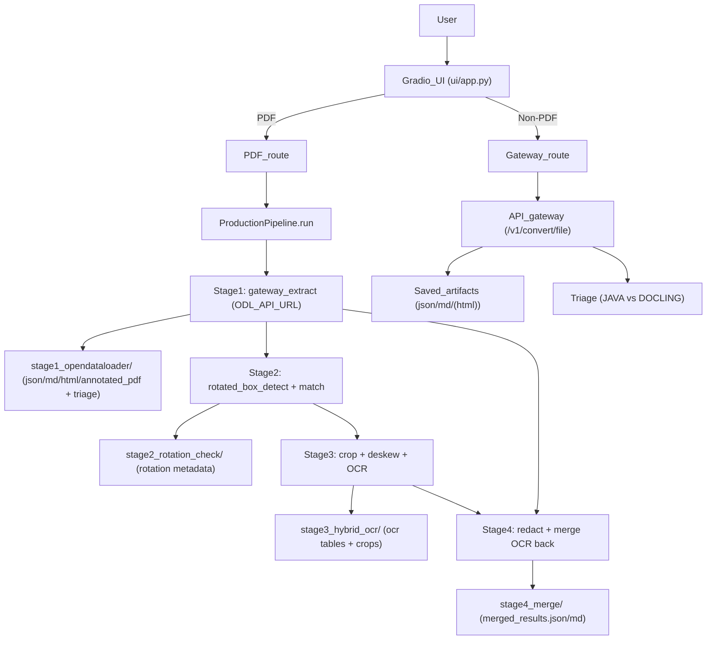

# OpenDataLoader (Unified UI + Native Table Detector)

Unified Gradio UI that:
- **PDF**: runs the native 4-stage pipeline (detect rotated tables → OCR → merge back) and produces `annotated.pdf`, merged `json`, merged `markdown`, and `html`.
- **Non-PDF**: sends the document to the API gateway (`/v1/convert/file`) and produces `json` + `markdown` (and `html` if the gateway returns it).

---

## Quickstart

### Set up the environment

```bash
bash scripts/setup_env.sh
```

### Run the UI

```bash
bash scripts/run_ui.sh
```

Environment variables (optional):
- **`ODL_API_URL`**: gateway URL used by Stage 1 (default `http://localhost:8000/v1/convert/file`)
- **`ODL_API_TIMEOUT`**: gateway timeout in seconds (default `300`)
- **`GRADIO_SERVER_NAME`**: bind host (default `127.0.0.1`)
- **`GRADIO_SHARE`**: set to `1` to enable Gradio share links

### Run the pipeline from CLI (PDF only)

```bash
python native_table_detector/scripts/run_pipeline.py --pdf data/rotated_tables_clean.pdf --out output/test_run/
```

### Run Python in the project environment

```bash
bash scripts/run_env_python.sh "import opendataloader_pdf; print('ok')"
```

---

## Project layout

- `main.py`: starts the unified Gradio UI (imports `ui/app.py`)
- `ui/app.py`: unified UI (routes PDF → pipeline, non-PDF → gateway)
- `ui/services/`: processing logic used by the UI
- `native_table_detector/src/`: pipeline implementation (stages, detector, merge)
- `output/gradio_runs/`: run artifacts and debug outputs

---

## High-level flow



---

## Pipeline stages (PDF)

### Stage 1 — OpenDataLoader extraction (via gateway)
- Calls the API gateway and writes:
  - `<stem>.json`, `<stem>.md`, `<stem>.html`, `<stem>_annotated.pdf`
  - `<stem>_triage.json` and (if present) `<stem>_triage_summary.json`
- Parses tables (`kids[type=table]`) into `Stage1Result.tables` for later matching.

### Stage 2 — Rotation detection + matching
- Detects rotated table regions and matches them back to Stage 1 tables by overlap.
- Outputs `stage2_rotation_check.json` with OBB + AABB (tight and loose).

### Stage 3 — Crop + deskew + OCR
- Crops + deskews each detected rotated region and OCRs it with PaddleOCR.
- Writes debug patches under `stage3_hybrid_ocr/detection_<id>/`.

### Stage 4 — Redact + merge
- Removes (redacts) any Stage 1 content overlapping detected rotated regions.
- Replaces matched tables (and inserts OCR-only tables if needed).
- Writes:
  - `stage4_merge/merged_results.json`
  - `stage4_merge/merged_results.md`

---

## Outputs

### Per-run folder
Runs are saved under `output/gradio_runs/<timestamp>_<name>/`.

PDF runs include:
- `stage1_opendataloader/`
- `stage2_rotation_check/`
- `stage3_hybrid_ocr/`
- `stage4_merge/`

Non-PDF runs (gateway-only) include:
- `response_raw.json`
- `<stem>.json`
- `<stem>.md`
- `<stem>.html` (if returned)
- `triage.json` / `triage_summary.json` (if returned)

---

## Notes / performance

- Stage 2 and Stage 3 reuse a shared `fitz.Document` to avoid reopening the PDF.
- Stage 2 no longer renders debug patches by default (speedup); Stage 3 uses adaptive render scale for faster OCR crops.

